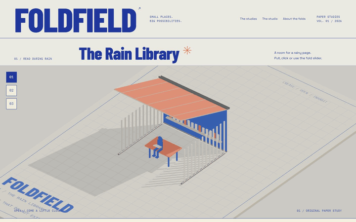
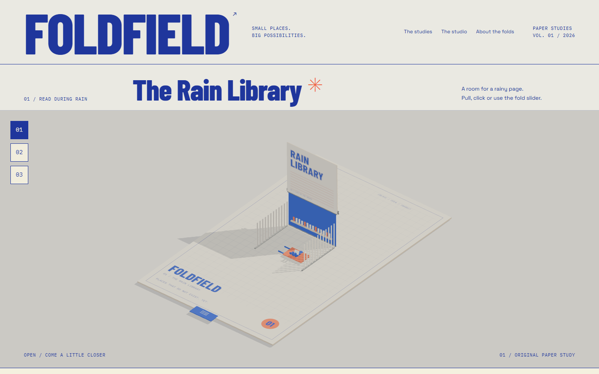
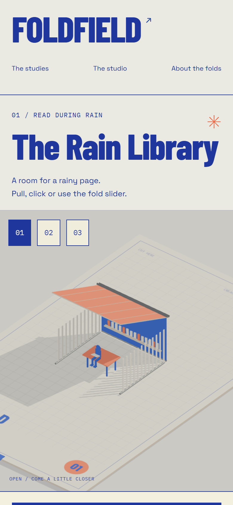

<p align="center"></p>

<p align="center">
  <a href="https://02-foldfield.williamking.workers.dev"></a>
  
  
  
  
  
  
</p>

**Three oversized postcards become small places.** A flat, printed cut pattern folds up into a room: a library for reading in the rain, a pavilion for listening to the wind, a theatre for an evening performance. An experiential 3D website about paper architecture.

<p align="center"></p>

## What you can do

- **Pick a study:** The Rain Library, The Listening Pavilion or The Sunset Theatre.
- **Pull the tab** and watch a flat, printed cut pattern fold up into a room along its hinges, then fold back the same way.
- **Shape the place:** span, roof, open, slatted or vellum panels, low sun, wind in the sails and rain, seen as an object, in plan, in section or from the seat.
- **Keep it:** save your postcard on this device, download it as an image, or turn it into a printable brief. Nothing is sent anywhere.

## What's inside

- **Three distinct mechanisms:** a hinged wall, canopy and folding seat for the library; three raised portals with swaying sails for the pavilion; splayed wings, canopy strips and risers for the theatre.
- **Paper you can read:** seeded fibre and grain, embossed scoring, thin sheet edges, brushed hinge pins and printed registration marks under a raking key light.
- **Prerendered pages** that read before JavaScript loads, an arrival loader, and a real 404.
- **Motion with care:** GSAP choreography throughout, and reduced motion respected.

## Screenshots

| Desktop | Phone |
| --- | --- |
|  |  |

## Built with

Direct Three.js for the folding rooms; React for the interface; GSAP for the folds and page choreography; Tailwind CSS with Lightning CSS; TypeScript throughout; Vite and Bun for the build.

## Run it locally

```sh
bun install --frozen-lockfile
bun run dev      # http://127.0.0.1:4512/
bun run check
bun run preview  # http://127.0.0.1:4612/
```

Design intent is in [DESIGN.md](DESIGN.md); the working history is in [docs/PROJECT-NOTES.md](docs/PROJECT-NOTES.md).

## Credits

Sources, authors and licences for everything shipped are in [CREDITS.md](CREDITS.md) and [assets.manifest.json](assets.manifest.json). All places and content are fictional.

---

<p align="center"><sub>Part of William King's portfolio collection.</sub></p>
