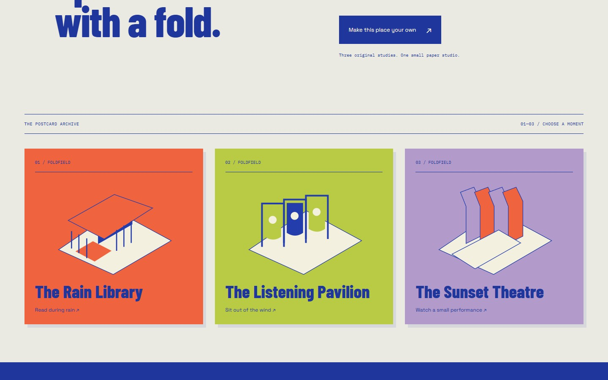

# FOLDFIELD

<p align="center"></p>

Three oversized postcards become small places. Pull a paper tab and a printed cut pattern rises into a rain library, a listening pavilion or a sunset theatre. Configure the architecture, study it from different views and take away your own postcard and brief.

**[Open the paper studio →](https://02-foldfield.williamking.workers.dev)** · [Run locally](#run-locally) · [Credits](#credits)

<p align="center"></p>

## Make a place

1. **Choose a study.** The Rain Library folds walls, a canopy and a seat; The Listening Pavilion raises portals and fabric-like sails; The Sunset Theatre opens wings, canopy strips and stepped seating.
2. **Pull the tab.** Fold the printed pattern into a room, stop partway to inspect the mechanism, or return it to the flat sheet.
3. **Change the configuration.** Adjust span, roof and side screens; explore open, slatted or vellum treatments and the study's light, wind or rain controls.
4. **Change your viewpoint.** Inspect the object, plan, section and seated view. Drawings and model follow the same configuration.
5. **Keep the idea.** Save locally, download a postcard image and prepare a printable brief. Nothing is submitted to a studio or remote service.

## Paper, movement and structure

The rooms are authored directly in Three.js. Hinges move related parts together, so folding is a readable mechanism rather than a swap between unrelated models. Fibre, grain, scoring, sheet edges, hinge pins and registration marks make the flat pattern and erected room feel like the same object.

React owns the configurator and saved state; GSAP handles folding and transitions. Native controls remain available alongside the scene. Reduced motion avoids relying on a long animated fold to communicate the selected result.

Five prerendered routes cover the arrival, studio, brief, about page and 404. The page remains readable before JavaScript; the interactive model, saving and image export enhance that foundation.

## Project map

- [src/domain.ts](src/domain.ts): studies, configuration constraints and shareable state.
- [src/App.tsx](src/App.tsx): controls, local persistence and brief workflow.
- [src/Drawings.tsx](src/Drawings.tsx): plan and section views.
- [src/World.tsx](src/World.tsx) and [src/world/](src/world/): folding mechanisms, paper, table and rain.
- [src/export.ts](src/export.ts): postcard export.

## Verification and scope

The production website is implemented and public at application revision `a48b3f1`. The check command runs strict types, formatting/lint, domain tests and the prerendered build. Browser procedures live in [tools/browser/](tools/browser/); [DESIGN.md](DESIGN.md) explains the intended experience. Older reset and provisioning notes are historical, not a description of the current live site. All studies and places are fictional.

## Current screenshots

| Desktop | Phone |
| --- | --- |
|  |  |



The opening loop and three main screenshots were captured from the live site on **1 October 2026**, using Chrome on this workstation; the phone image is a 390 × 844 browser viewport. The animated preview is a short loop, not a full playthrough. [Capture details](docs/readme/capture.json).

## Run locally

Use **Bun 1.3.10** (the version pinned in `package.json`) and Node.js 22.12 or newer. From this repository:

```sh
bun install --frozen-lockfile
bun run dev      # http://127.0.0.1:4512/
bun run check    # strict types, Biome, unit tests and production build
bun run preview  # http://127.0.0.1:4612/ after the build
```

Development and preview are separate long-running commands; run one at a time or use separate terminals. `bun run build` writes the static production output to `dist/`. Dependencies and the lockfile are local to this project.

## Stack and release

Direct Three.js 0.186 · React 19.3 · strict TypeScript · Vite 8.3 · GSAP 3.15 · Tailwind CSS 4.3 · Bun 1.3.10 · Biome. The public website is served by Cloudflare Workers. This README describes [application revision a48b3f1](https://github.com/WilliamHenryKing/02-foldfield/commit/a48b3f11a985539e48db107ce1171ea61d8d0d63); the documentation refresh changes no application behaviour.

## Credits

Sources, authors and licences for everything shipped are in [CREDITS.md](CREDITS.md) and [assets.manifest.json](assets.manifest.json). All places and content are fictional.

---

Part of [William King's portfolio collection](https://github.com/WilliamHenryKing).
